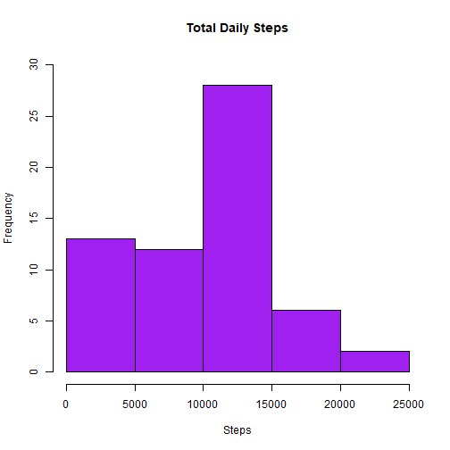
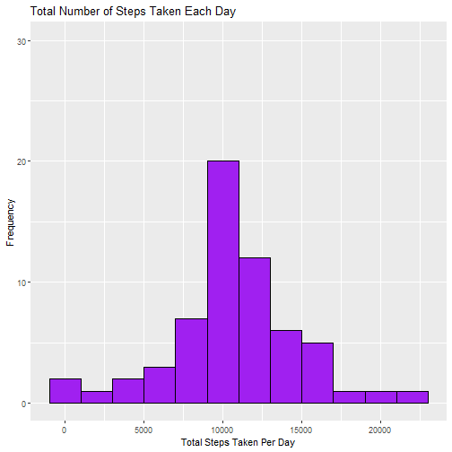

## R Markdown

This is an R Markdown document. Markdown is a simple formatting syntax for authoring HTML, PDF, and MS Word documents. For more details on using R Markdown see <http://rmarkdown.rstudio.com>.

When you click the **Knit** button a document will be generated that includes both content as well as the output of any embedded R code chunks within the document. You can embed an R code chunk like this:


```r
#Installing Packages
library("plyr")
library("dplyr")
library("ggplot2")
library("data.table")
```


```r
#Preprocessing the Data
uzp <- "C:/Users/micha/OneDrive/Desktop/repdata_data_activity.zip"  

unzip(uzp, exdir = "C:/Users/micha/OneDrive/Documents/Mod5CP1") 

data <- read.csv("activity.csv")
datadates <- as.Date(data$date)
```


```r
#Q1) What is the mean total number of steps taken per day?
    #Calculating the total steps taken on a day
Dailysteps <- data %>%
  group_by(date)%>%
  summarize(sumsteps =sum(steps, na.rm = TRUE))

    #Making Histogram
hist(Dailysteps$sumsteps, main= "Total Daily Steps", col="purple", xlab= "Steps", ylim = c(0,30))
```



```r
    #Calculating the mean and median
Meansteps <- mean(Dailysteps$sumsteps)
print(Meansteps)
```

```
## [1] 9354.23
```

```r
Mediansteps <- median(Dailysteps$sumsteps)
print(Mediansteps)
```

```
## [1] 10395
```


```r
#Q2) What is the average daily activity pattern?
    #Calculating the avergae number of steps taken per 5 minute interval
Interval_Steps <- data%>%
  group_by(interval)%>%
  summarize(mean(steps, na.rm = TRUE))
    #Changing column names to match summarized data
names(Interval_Steps) <- c("interval", "mean")

    #Plotting data
ggplot(Interval_Steps, mapping = aes(interval, mean))+
  geom_line(col= "purple")+
  xlab("5 Minute Intervals")+
  ylab("Average Number of Steps")+
  ggtitle("Average Number of Steps per 5 Minute Interval")
```


```r
    #Finding the maximum number of steps
Interval_Steps[which.max(Interval_Steps$mean),]$interval
```

```
## [1] 835
```


```r
#Q3) Impute Missing Values in the Data 
    #Form a missing value variable
Missingdata <- sum(is.na(data$steps))

    #Match mean data to missing values
MeanImpute <- Interval_Steps$mean[match(data$interval,Interval_Steps$interval)]

    #Creating new dataset with matched data
Imputed_data <- transform(data, steps = ifelse(is.na(data$steps), yes = MeanImpute, no = data$steps))

Total_Imputed_data <- Imputed_data %>% group_by(date) %>% summarise(daily_steps = sum(steps))

    #plotting imputed dataset
ggplot(Total_Imputed_data, aes(x= daily_steps))+
  geom_histogram(binwidth= 2000, fill= "purple", col = "black")+
  ylim(0,30)+
  xlab("Total Steps Taken Per Day")+
  ylab("Frequency")+
  ggtitle("Total Number of Steps Taken Each Day")
```



```r
    #calculating the mean and median total number of steps taken each day
Mean_Imputed_Steps <- mean(Total_Imputed_data$daily_steps)

print(Mean_Imputed_Steps)
```

```
## [1] 10766.19
```

```r
Median_Imputed_Steps <- median(Total_Imputed_data$daily_steps)

print(Median_Imputed_Steps)
```

```
## [1] 10766.19
```

```r
#A) The values do not differ from the estimates from the first part of the assignment. The impact that imputing the missing data had on the estimates of the total daily number of steps is that it made them equal due to the averaging function.
```


```r
#Q4)Are there differences in activity patterns between weekdays and weekends?
    #Changing the format of dates
data$date <- as.Date(strptime(data$date, format = "%Y%m%d"))

    #Creating new variable that indicates if day is either a weekday or weekend
data_days <- Imputed_data

data_days$date <- as.Date(data_days$date)

data_days$day <- ifelse(weekdays(data_days$date) %in% c("saturday", "Sunday"), "weekends", "weekday")

data_days$day <- as.factor(data_days$day)

    #Creating a Panel Plot containing a time series
Data_Weekday <- filter(data_days, data_days$day == "weekday")

Data_Weekends <- filter(data_days, data_days$day == "weekends")

Data_Weekday <- Data_Weekday %>%
        group_by(interval) %>%
        summarize(steps = mean(steps))
Data_Weekday$day <- "Weekday"

Data_Weekend <- Data_Weekends %>%
        group_by(interval) %>%
        summarize(steps = mean(steps))
Data_Weekend$day <- "Weekend"

DataType <- rbind(Data_Weekday, Data_Weekend)

DataType$day <- as.factor(DataType$day)

ggplot (DataType, aes (interval, steps))+
  geom_line() + facet_grid(day~.) +
  xlab("Interval")+
  ylab("Average Number of Steps")+
  ggtitle("Average Number of Steps Based on Type of Day")
```


knit2html("PA1_template.Rmd")

